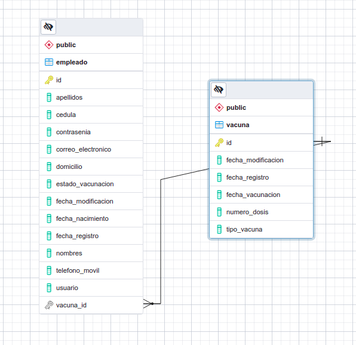

# Spring Boot API REST para el registro del inventario de estado de vacunación de empleados

API REST para llevar un registro del inventario del estado de vacunación de los empleados 
en una empresa, con base en el lenguaje JAVA, Spring Boot Framework y PostgreSQL.

Nota.- Se emplea el patrón DTO.

## Condiciones

1. La aplicación cuenta con 2 roles: Administrador y Empleado.
2. Como Administrador se requiere registrar, editar, listar y eliminar a los empleados.
3. Como Empleado se requiere visualizar y actualizar la información.

## Modelo de Datos

En base a las condiciones anteriores se tiene la siguiente aproximación:



Aclaración inmediata: En el modelo se incluyen dos campos del tipo enum, dentro de las clases Empleado y Vacuna.

* Para la clase "Empleado" en el campo "estado_vacunacion" los valores permitidos son: [VACUNADO, NO_VACUNADO]
* Para la clase "vacuna" en el campo "tipo_vacuna" los valores permitidos son: [SPUTNIK_V, ASTRA_ZENECA, PFIZER, JHONSON_AND_JHONSON]

## Construcción del Proyecto

### 0. Tecnologías/Herramientas utilizadas

Esta es la lista de todas las tecnologías y/o herramientas utilizadas en el proceso de construcción del proyecto.

* Java 11
* Maven 3.6.3
* Spring Boot 2.5.6
  * Dependencias: Spring Web, Spring Boot DevTools, Lombok, Mapstruct, Validation, Swagger, PostgreSQLDriver
* PostgreSQL 14.0
* IntelliJ IDEA 2021.2.3 (Community Edition)
  * Plugin recomendado: Lombok
* Insomnia 2021.5.3

### 1. Clonación del repo

#### Pasos:

1) Descargar este Proyecto y realizar la importación con `Intellij IDEA`.
```
git clone https://github.com/alefiengo/inventario-vacunacion-empleados.git
```
Nota.- Esperar hasta que se actualicen todas las dependencias a través de `Maven`. 

2) Crear una base de datos PostgreSQL con el nombre `vacunacion_db`.

3) Configurar las credenciales de acceso a la base de datos el archivo `application.properties` dentro de `src/main/resources/`. 
Es decir, personalizar las variables `spring.datasource.username` y `spring.datasource.password`.

## Ejecución de la Aplicación

#### Pasos:

1) Ingresar al archivo `InventarioVacunacionEmpleadosApplication.java` dentro de `src/main/java/com/alefiengo/inventariovacunacionempleados/`.

2) A continuación dar clic sobre el botón ejecutar (aproximadamente sobre la línea 9).


3) Esperar a que la aplicación compile y se ejecute.

4) Obtendremos una respuesta similar en la barra de herramientas.


## Acceder a la Documentación

#### Pasos

 1) En un navegador web, ingresar a la siguente url:
```
http://localhost:8081/api/v1/swagger-ui/index.html
```

2) Explorar los `endpoints` para el rol `ADMINISTRADOR` y para el rol `EMPLEADO`.

## Extras

* Dentro de del directorio `inventario-vacunacion-empleados/extras` se tiene el archivo `Insomnia_2021-10-25.json`, el cual se puede importar desde `Insomnia` para explorar los endpoints.